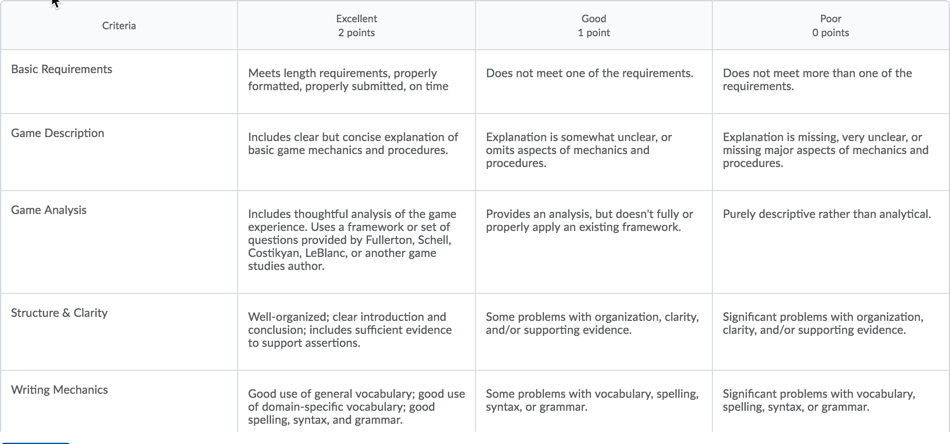

|  IGME-220: Game Design & Development I, Spring 2018 | [Syllabus](README.md) | [Schedule](Schedule.md) |
|----|----|----|

# Analog Game Analysis Paper

Write a thorough analysis of a digital game. It should be one that you've played yourself. You also should have observed others playing it--although that could be observations you made at Reboot, or even videos of gameplay that you've watched. 

Each student must pick a different game to analyze; use Slack to coordinate your choices. 

## Required Elements

### Game Details
At the beginning of the paper, you should fully identify the game you are analyzing, including the name of the publisher and designer (if available), and the year of publication or first appearance (again, if available). Cite your source(s) for this. If you are unable to find the information, describe where you looked for it. 

### Audience
Who is the audience for the game that you analyzed? Consider both demographics (age, gender, location) and player type (using Quantic Foundry's model, or something comparable). What information did you use to determine the intended and/or actual audience? 

### Mechanics, Dynamics, Aesthetics
Describe your experience of playing the game, as well as observations you have made of others playing it. Using the MDA framework, discuss how the mechanics of the game enable the dynamics that you observed, and how those in turn generated the aesthetic you experienced/observed. 

Avoid using hyperbole and descriptive adjectives such as "brilliant" or "great." Instead, explain why and how specific game elements work or do not work. You can also discuss how you think that specific elements could be modified to make the game better or more interesting. 

### Literature Review
Has this game been reviewed or analyzed by others? (You'll need to do some research to determine this.) If so, did you agree or disagree with their assessment? Why or why not?

## Citing Your Sources
Ideas and concepts that are not your original ideas ***must be cited***. Sources of factual material about the game ("it is the most popular card game ever", "it was the first game of type X ever released", "it received poor reviews", etc) must always be cited. Quotations must always be cited. Paraphrases must always be cited. If you use a source without proper citation, the assignment will be graded a zero and you may fail the course for plagiarism. When in doubt, ask me! 

## Mechanics
* The paper is due by noon on Sunday, 6 May. It must be submitted to the Dropbox in myCourses in Word (.doc or .docx) or PDF format. 
* It must be at least 1000 words in length, but no longer than 1500 words. (Word count does not include your name, the title, references, abstracts, etc.)
* It should be spell-checked and proofread. Proper grammar and word usage is required.

## Rubric

